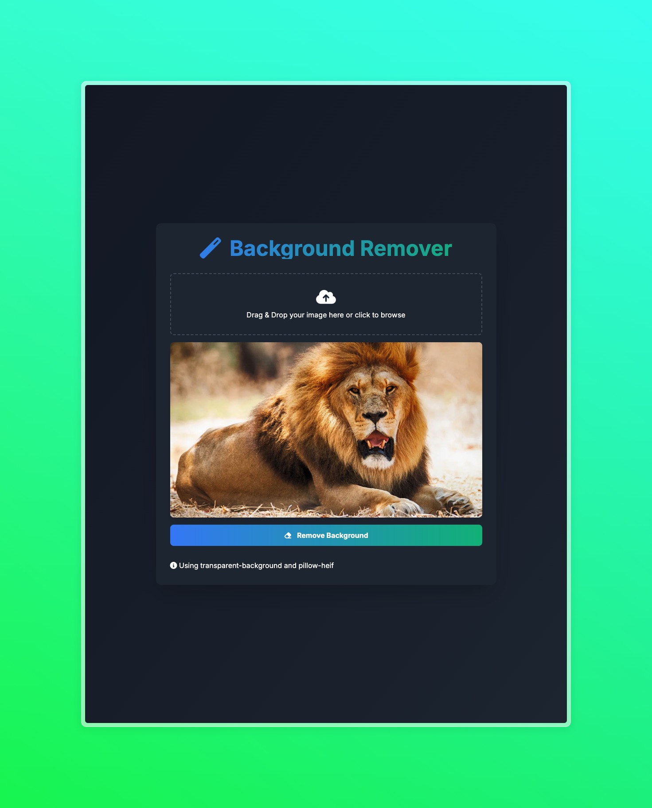
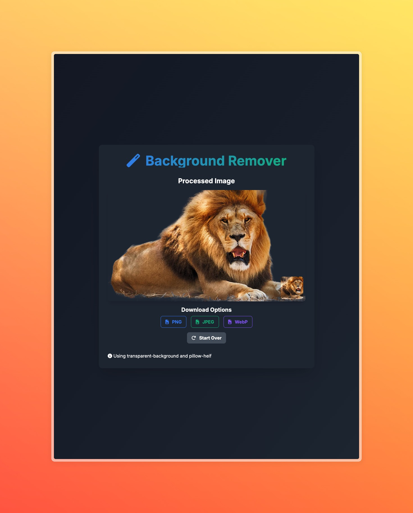

# Background Remover Web App

This is a Flask-based web application that allows users to upload or paste an image, remove its background, and download the result in various formats. It supports multiple image formats, including HEIC.

## Features

- Upload images (including HEIC format)
- Paste images directly from clipboard
- Preview uploaded/pasted images before processing
- Remove background from images
- Download processed images in PNG, JPEG, or WebP formats
- Responsive and user-friendly interface

## Screenshots

Here are some screenshots of the Background Remover Web App in action:

### Original Image Upload


### Processed Image with Background Removed


## Prerequisites

- Python 3.7 or higher
- pip (Python package installer)

## Installation

1. Clone this repository:
   ```
   git clone https://github.com/yourusername/background-remover-app.git
   cd background-remover-app
   ```

2. Create a virtual environment:
   ```
   python -m venv venv
   ```

3. Activate the virtual environment:
   - On Windows:
     ```
     venv\Scripts\activate
     ```
   - On macOS and Linux:
     ```
     source venv/bin/activate
     ```

4. Install the required packages:
   ```
   pip install -r requirements.txt
   ```

## Usage

1. Run the Flask application:
   ```
   python app.py
   ```

2. Open a web browser and navigate to `http://localhost:5000`

3. Upload an image using the "Choose an image" button or paste an image directly from your clipboard

4. Preview the uploaded/pasted image

5. Click "Remove Background" to process the image

6. Once processed, you can download the result in PNG, JPEG, or WebP format

## Project Structure

- `app.py`: Main Flask application
- `templates/index.html`: HTML template for the web interface
- `static/styles.css`: CSS styles for the web interface
- `requirements.txt`: List of Python dependencies
- `uploads/`: Temporary folder for uploaded images (created automatically)

## Technologies Used

- Flask: Web framework
- Pillow: Image processing
- transparent-background: Background removal
- pillow-heif: HEIC image support
- Font Awesome: Icons

## License

This project is open source and available under the [MIT License](LICENSE).

## Contributing

Contributions, issues, and feature requests are welcome. Feel free to check [issues page](https://github.com/yourusername/background-remover-app/issues) if you want to contribute.

## Acknowledgements

- [transparent-background](https://github.com/plemeri/transparent-background) for the background removal functionality
- [pillow-heif](https://github.com/bigcat88/pillow_heif) for HEIC image support